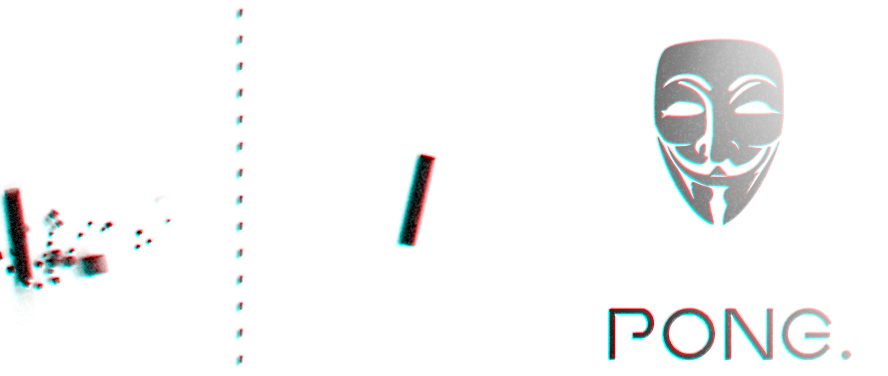

What is Gecs?
#############

Gecs (*Good Entity—Component—System*) is a game engine that originated in the development the game `Pong. <https://github.com/philiparvidsson/Pong>`_.

Game using Gecs
===============

* *Pong.
--------

